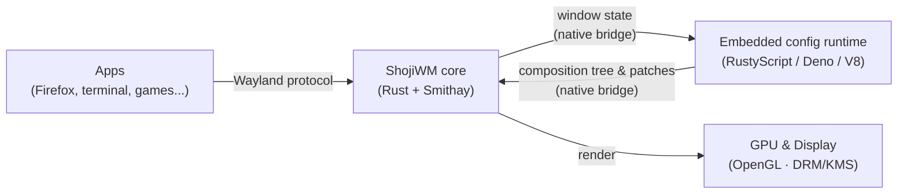
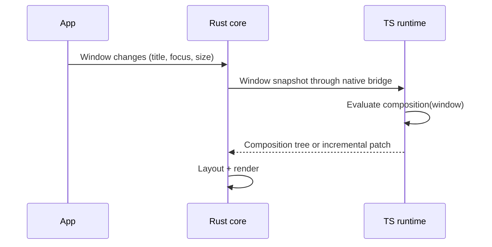

# ShojiWM Architecture

In one sentence: **ShojiWM is a Wayland compositor with a fast core written in
Rust, whose look and behavior you describe in TypeScript/TSX.**

## The big picture



- **Apps** talk to ShojiWM through the standard **Wayland protocol**.
- The **Rust core** handles input, windows, and rendering — the parts that must
  be fast and reliable.
- The **TypeScript config runtime** decides how windows look and behave. It runs
  inside the `shoji_wm` process on the Deno/V8 engine embedded through
  RustyScript. You write this part.
- The core draws the final frame on the **GPU**.

## Two worlds: Rust core and TypeScript config

ShojiWM splits responsibilities into two layers inside one process:

| Layer | Runtime | Responsibility |
| --- | --- | --- |
| Core | Rust + Smithay | Wayland protocol, input, layout, GPU rendering |
| Config | TypeScript/TSX on embedded Deno/V8 | Window decorations, layout rules, effects, keybindings |

The config layer runs in an embedded V8 isolate rather than a separate Node.js
process. Rust and TypeScript exchange typed requests, composition trees, and
incremental patches through the in-process native bridge. Performance-sensitive
updates such as signal-driven shader uniforms avoid the old JSON process
boundary.

Node.js is therefore not required to run ShojiWM. It is only used by optional
repository tooling such as standalone TypeScript checks and the Docusaurus
documentation site.

## Server-Side Decoration (SSD) flow



## Directory layout

```
src/        Rust core (compositor, IPC, protocol, portal)
packages/   TypeScript SDK (shoji_wm) and user config
```
