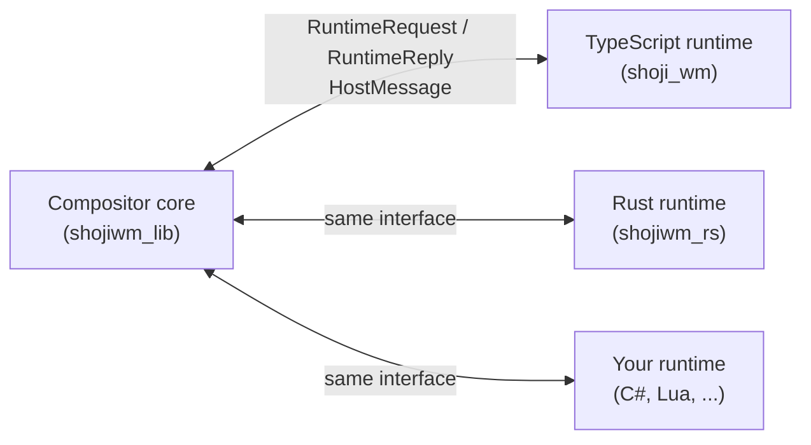

# Config languages

TypeScript/TSX is ShojiWM's default config language, but it is not the only
one. The compositor core does not know which language your config is written
in: it talks to a **config runtime** through a small, language-neutral
interface. ShojiWM ships two runtimes, and you can add your own.

| Language | How it runs | Hot reload | Status |
| --- | --- | --- | --- |
| **TypeScript/TSX** | Embedded Deno/V8 inside the default `shoji_wm` binary | Yes (`Super` + `Shift` + `R`) | Default; the rest of this section uses it |
| **Rust** | Your config is a crate built on [`shojiwm_rs`](https://github.com/bea4dev/ShojiWM/tree/main/src/shojiwm_rs); it compiles into its own compositor binary | No (rebuild and restart) | Supported; the default config is ported as an example |
| **Any other language** | Implement the runtime interface of `shojiwm_lib` (in-process via FFI, a VM, ...) | Up to the runtime | The interface is ready; no third runtime ships yet |



## Rust

`shojiwm_rs` mirrors the TypeScript SDK: signals and memos in the style of
SolidJS, view builders for the same nodes as the TSX components, and a
`COMPOSITOR` value with the same controllers. A config written in TSX ports to
Rust almost line by line.

```rust
use shojiwm_rs::prelude::*;

fn main() -> std::process::ExitCode {
    run_config(|| {
        COMPOSITOR.key.bind("terminal", "Super+T", || {
            COMPOSITOR.process.spawn(Command::exec(["kitty"]));
        });

        COMPOSITOR.window.composition(|window| {
            let border = window
                .is_focused()
                .map(|focused| if *focused { hex("#d7ba7d") } else { hex("#4f5666") });
            ManagedWindow::new().child(
                WindowBorder::new()
                    .style(Style::new().border(2.0, border).border_radius(10.0))
                    .child(
                        Flex::column()
                            .child(Label::new(window.title()).style(Style::new().height(30.0)))
                            .child(ClientWindow::new()),
                    ),
            )
        });
    })
}
```

### The default config, in Rust

The whole default config — the hybrid floating/tiling window manager,
keybindings, the bar IPC, effects and the titlebar — is ported to Rust as an
example:

| TypeScript (`packages/config/src/`) | Rust (`src/shojiwm_rs/examples/default_config/`) |
| --- | --- |
| `index.tsx` | `main.rs` |
| `window-manager.ts` | `window_manager.rs`, `workspace.rs` |
| `window-animation.ts` | `window_animation.rs` |
| `effect/island-glass.ts` | `island_glass.rs` |
| `window-switcher.tsx` | `window_switcher.rs` |
| `flip-3d.tsx` | `flip_3d.rs` |
| `window-grid.tsx` | `window_grid.rs` |

It reuses the shaders and icons of `packages/config`. Run it from a source
checkout (inside `nix develop`, or with the dependencies from
[Installation](../getting-started/installation.md)):

```sh
# Nested in your current session
cargo run -p shojiwm_rs --example default_config

# Optimized build, e.g. to judge animations
cargo run -p shojiwm_rs --example default_config --profile release-fast

# On the console (DRM/KMS)
cargo build -p shojiwm_rs --example default_config --release
./target/release/examples/default_config --tty
```

The binary accepts the same command-line options as `shoji_wm` (`--tty`,
`--tty-output`, `--log-off`, ...; see `--help`).

### Writing your own

A Rust config is an ordinary binary crate:

```toml
[dependencies]
shojiwm_rs = { path = "/path/to/ShojiWM/src/shojiwm_rs" }
```

```rust
use shojiwm_rs::prelude::*;

fn main() -> std::process::ExitCode {
    ConfigBuilder::new(setup)
        // Relative shader and image paths resolve against this directory.
        .asset_root(concat!(env!("CARGO_MANIFEST_DIR"), "/assets"))
        .run()
}

fn setup() {
    // Register key bindings, the composition, effects, listeners, ...
}
```

### From TSX to Rust

| TypeScript | Rust |
| --- | --- |
| `signal` / `computed` / `effect` | `signal` / `memo` / `effect` |
| `useState(false)` in a component | `signal(false)` in the function building the element |
| `sig((x) => ...)` | `sig.map(\|x\| ...)` |
| `createWindowState("rect", { default })` | `static RECT: WindowStateKey<Rect> = WindowStateKey::new("rect", \|w\| w.rect());` then `window.state(&RECT)` |
| `<Box direction="row">` | `Flex::row()` |
| `<Label>`, `<Button>`, `<Image>`, `<AppIcon>` | `Label::new`, `Button::new`, `Image::new`, `AppIcon::new` |
| `<ShaderEffect>`, `<WindowBorder>`, `<ClientWindow />` | `ShaderEffect::new`, `WindowBorder::new`, `ClientWindow::new` |
| `<ManagedWindow rect=.. zIndex=..>` | `ManagedWindow::new().rect(..).z_index(..)` |
| `style={{ ... }}` | `.style(Style::new()...)` |
| `{hover() && <Icon />}` | `.child_dyn(move \|\| hover.get().then(icon))` |
| `compileEffect({ input, pipeline })` | `Effect::new(input).stage(..)` |
| `get("name")` (saved texture) | `saved("name")` |
| `setTimeout` | `set_timeout` |
| `createPoll(ms, cb, { output })` / `window.createPoll` / `createPollForEachOutput` | `create_poll(ms, output, cb)` / `window.create_poll` / `create_poll_for_each_output` |
| `createIpcServer()` | `shojiwm_rs::ipc::IpcServer` (same protocol) |
| `COMPOSITOR.effect.background_effect = computed(..)` | `COMPOSITOR.effect.background_with(\|\| ..)` |
| `COMPOSITOR.effect.overlay(output, { effect })` | `COMPOSITOR.effect.overlay(output, Overlay::new(effect))` (returns at once; `on_ready` / `on_closed` instead of awaiting) |
| `COMPOSITOR.rendering.framePacing = ..` | `COMPOSITOR.rendering.frame_pacing(..)` / `frame_pacing_with(\|output\| ..)` |
| `COMPOSITOR.rendering.composition = (output) => <DefaultComposition />` | `COMPOSITOR.rendering.composition(\|output\| OutputStack::default_stacking())` |
| `<Layers>`, `<Windows>`, `<Scene3D>`, `<Plane>`, `renderTexture()` | `Layers::new`, `Windows::all` / `Windows::only`, `Scene3D::new`, `Plane::new`, `RenderTexture::new` |
| `COMPOSITOR.input.grab({ onKey, ... })` | `COMPOSITOR.input.grab(InputGrabOptions::new().on_key(..))` |

Things that work differently:

- **The composition function runs once per window.** Props that are signals,
  memos or `derive(..)`d values are tracked per node, and only the node (or,
  for a shader uniform, only the uniform) that changed is sent to the
  compositor. Reading a signal directly in the function body makes the whole
  function run again when it changes — use that for structural switches such
  as fullscreen, and `child_dyn` for parts that come and go.
- **No hot reload.** Rebuild and restart instead.
- **A panic in config code does not take the session down**; it is reported
  as a config error, like an exception in a TypeScript config.

The API reference is the crate documentation:
`cargo doc -p shojiwm_rs --open`.

## Any other language

The runtime interface lives in
[`shojiwm_lib::runtime_api`](https://github.com/bea4dev/ShojiWM/tree/main/src/shojiwm_lib/src/runtime_api).
A runtime for another language (C# through CoreCLR, Lua, Python, ...) is a
crate that depends on `shojiwm_lib` only, so it never links V8, and builds its
own binary:

```rust
use shojiwm_lib::runtime_api::*;

struct MyLauncher;

impl RuntimeLauncher for MyLauncher {
    fn name(&self) -> &'static str {
        "lua"
    }

    fn launch(&self, context: LaunchContext) -> Box<dyn ConfigRuntime> {
        // Start the interpreter and load `context.config_path`.
        Box::new(MyRuntime { host: context.host })
    }
}

struct MyRuntime {
    host: RuntimeHost,
}

impl ConfigRuntime for MyRuntime {
    fn request(
        &mut self,
        now_ms: f64,
        request: RuntimeRequest<'_>,
    ) -> Result<RuntimeReply, RuntimeError> {
        // Forward the request to the language and translate the answer.
        // Anything not handled falls back to the compositor's built-in behavior.
        Ok(RuntimeReply::Unhandled)
    }
}

fn main() -> std::process::ExitCode {
    shojiwm_lib::run(MyLauncher)
}
```

- **Requests** (`RuntimeRequest`) need an answer within the compositor's turn:
  decoration trees, window and input hooks, effects, scheduler ticks.
  Answering `Unhandled` keeps the built-in behavior, so a runtime can start
  with a handful of requests and grow.
- **Events** (`RuntimeEvent`) are fire-and-forget: outputs, input devices,
  keyboard layout.
- **Side effects** — key bindings, outputs, processes, environment — go back
  through `RuntimeHost::send(HostMessage)`, which also works from other
  threads.
- **Hot reload** has two halves. `prepare_reload` must return at once: a
  runtime that has to compile (C#, ...) starts the build there, answers
  `ReloadPreparation::Pending` and keeps serving the old config. When the
  build is done it sends `HostMessage::ReloadReady`, and the compositor calls
  `reload` to swap. A runtime that loads quickly only implements `reload`.
- `SchedulerTick` and cached evaluations run every frame while something
  animates; keep those paths free of serialization.

The TypeScript runtime (`src/shojiwm`) and the Rust runtime (`src/shojiwm_rs`)
are complete implementations to learn from, and
[`knowledges/config-runtime-api.md`](https://github.com/bea4dev/ShojiWM/blob/main/knowledges/config-runtime-api.md)
describes the protocol in detail.
