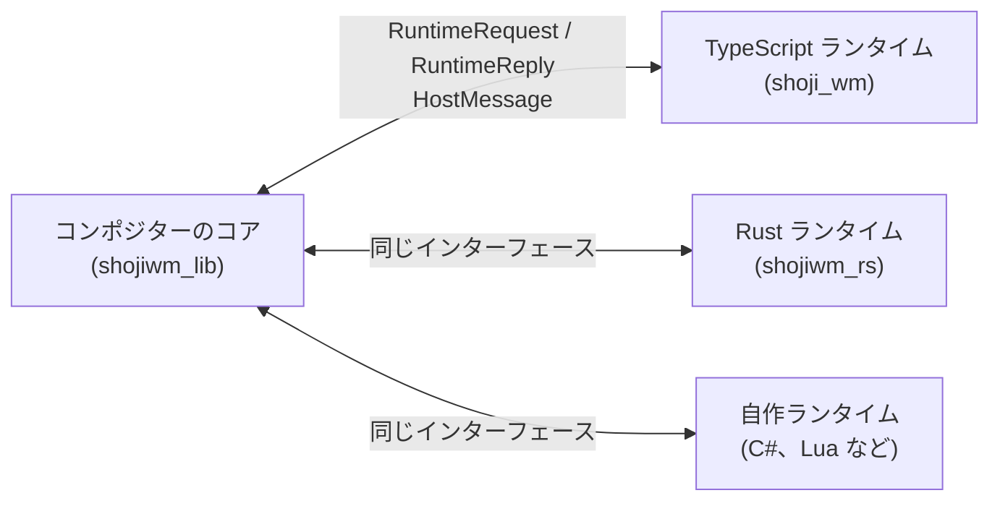

# 設定言語

ShojiWM の標準の設定言語は TypeScript/TSX ですが、選べる言語はそれだけでは
ありません。コンポジターのコアは、設定がどの言語で書かれているかを知りません。
言語に依存しない小さなインターフェースを通して **設定ランタイム** とやり取り
しているだけです。ShojiWM には 2 つのランタイムが付属しており、自分で追加する
こともできます。

| 言語 | 動き方 | ホットリロード | 状況 |
| --- | --- | --- | --- |
| **TypeScript/TSX** | 標準の `shoji_wm` バイナリに組み込まれた Deno/V8 上で動く | あり（`Super` + `Shift` + `R`） | 標準。この章の他のページはこちらを前提にしています |
| **Rust** | 設定は [`shojiwm_rs`](https://github.com/bea4dev/ShojiWM/tree/main/src/shojiwm_rs) を使うクレートで、コンポジター込みの独自バイナリにコンパイルされる | なし（再ビルドして再起動） | 対応済み。デフォルト設定の移植が example として付属 |
| **その他の任意の言語** | `shojiwm_lib` のランタイムインターフェースを実装する（FFI での組み込み、VM など） | ランタイム次第 | インターフェースは用意済み。3 つ目のランタイムはまだ付属していません |



## Rust

`shojiwm_rs` は TypeScript SDK と同じ形をしています。SolidJS 風のシグナルと
メモ、TSX のコンポーネントと同じノードを組み立てるビュービルダー、同じ
コントローラーを持つ `COMPOSITOR` があります。TSX で書いた設定は、ほぼ 1 行ずつ
Rust に書き写せます。

```rust
use shojiwm_rs::prelude::*;

fn main() -> std::process::ExitCode {
    run_config(|| {
        COMPOSITOR.key.bind("terminal", "Super+T", || {
            COMPOSITOR.process.spawn(Command::exec(["kitty"]));
        });

        COMPOSITOR.window.composition(|window| {
            let border = window
                .is_focused()
                .map(|focused| if *focused { hex("#d7ba7d") } else { hex("#4f5666") });
            ManagedWindow::new().child(
                WindowBorder::new()
                    .style(Style::new().border(2.0, border).border_radius(10.0))
                    .child(
                        Flex::column()
                            .child(Label::new(window.title()).style(Style::new().height(30.0)))
                            .child(ClientWindow::new()),
                    ),
            )
        });
    })
}
```

### Rust 版のデフォルト設定

デフォルト設定のすべてを Rust に移植した example があります。フローティングと
タイリングを切り替えられるウィンドウマネージャ、キーバインド、バー向けの IPC、
エフェクト、タイトルバーまで含みます。

| TypeScript（`packages/config/src/`） | Rust（`src/shojiwm_rs/examples/default_config/`） |
| --- | --- |
| `index.tsx` | `main.rs` |
| `window-manager.ts` | `window_manager.rs`、`workspace.rs` |
| `window-animation.ts` | `window_animation.rs` |
| `effect/island-glass.ts` | `island_glass.rs` |
| `window-switcher.tsx` | `window_switcher.rs` |
| `flip-3d.tsx` | `flip_3d.rs` |
| `window-grid.tsx` | `window_grid.rs` |

シェーダーとアイコンは `packages/config` のものをそのまま使います。ソースの
チェックアウトから起動してください（`nix develop` の中か、
[インストール](../getting-started/installation.md) の依存関係を入れた環境で）。

```sh
# 今のセッションの中にウィンドウとして起動
cargo run -p shojiwm_rs --example default_config

# 最適化ビルド（アニメーションの確認などに）
cargo run -p shojiwm_rs --example default_config --profile release-fast

# コンソール（DRM/KMS）で起動
cargo build -p shojiwm_rs --example default_config --release
./target/release/examples/default_config --tty
```

コマンドラインオプションは `shoji_wm` と共通です（`--tty`、`--tty-output`、
`--log-off` など。一覧は `--help` で確認できます）。

### 自分の設定を書く

Rust の設定は普通のバイナリクレートです。

```toml
[dependencies]
shojiwm_rs = { path = "/path/to/ShojiWM/src/shojiwm_rs" }
```

```rust
use shojiwm_rs::prelude::*;

fn main() -> std::process::ExitCode {
    ConfigBuilder::new(setup)
        // シェーダーや画像の相対パスはこのディレクトリを基準に解決されます。
        .asset_root(concat!(env!("CARGO_MANIFEST_DIR"), "/assets"))
        .run()
}

fn setup() {
    // キーバインド、コンポジション、エフェクト、イベントリスナーなどを登録する
}
```

### TSX から Rust への対応

| TypeScript | Rust |
| --- | --- |
| `signal` / `computed` / `effect` | `signal` / `memo` / `effect` |
| コンポーネント内の `useState(false)` | 要素を組み立てる関数の中で `signal(false)` |
| `sig((x) => ...)` | `sig.map(\|x\| ...)` |
| `createWindowState("rect", { default })` | `static RECT: WindowStateKey<Rect> = WindowStateKey::new("rect", \|w\| w.rect());` として `window.state(&RECT)` |
| `<Box direction="row">` | `Flex::row()` |
| `<Label>`、`<Button>`、`<Image>`、`<AppIcon>` | `Label::new`、`Button::new`、`Image::new`、`AppIcon::new` |
| `<ShaderEffect>`、`<WindowBorder>`、`<ClientWindow />` | `ShaderEffect::new`、`WindowBorder::new`、`ClientWindow::new` |
| `<ManagedWindow rect=.. zIndex=..>` | `ManagedWindow::new().rect(..).z_index(..)` |
| `style={{ ... }}` | `.style(Style::new()...)` |
| `{hover() && <Icon />}` | `.child_dyn(move \|\| hover.get().then(icon))` |
| `compileEffect({ input, pipeline })` | `Effect::new(input).stage(..)` |
| `get("name")`（保存したテクスチャ） | `saved("name")` |
| `setTimeout` | `set_timeout` |
| `createPoll(ms, cb, { output })` / `window.createPoll` / `createPollForEachOutput` | `create_poll(ms, output, cb)` / `window.create_poll` / `create_poll_for_each_output` |
| `createIpcServer()` | `shojiwm_rs::ipc::IpcServer`（同じプロトコル） |
| `COMPOSITOR.effect.background_effect = computed(..)` | `COMPOSITOR.effect.background_with(\|\| ..)` |
| `COMPOSITOR.effect.overlay(output, { effect })` | `COMPOSITOR.effect.overlay(output, Overlay::new(effect))`（すぐ返る。await の代わりに `on_ready` / `on_closed`） |
| `COMPOSITOR.rendering.framePacing = ..` | `COMPOSITOR.rendering.frame_pacing(..)` / `frame_pacing_with(\|output\| ..)` |
| `COMPOSITOR.rendering.composition = (output) => <DefaultComposition />` | `COMPOSITOR.rendering.composition(\|output\| OutputStack::default_stacking())` |
| `<Layers>`, `<Windows>`, `<Scene3D>`, `<Plane>`, `renderTexture()` | `Layers::new`、`Windows::all` / `Windows::only`、`Scene3D::new`、`Plane::new`、`RenderTexture::new` |
| `COMPOSITOR.input.grab({ onKey, ... })` | `COMPOSITOR.input.grab(InputGrabOptions::new().on_key(..))` |

TypeScript と違う点:

- **コンポジション関数はウィンドウごとに 1 回だけ実行されます。** シグナル、
  メモ、`derive(..)` で作った props はノード単位で追跡され、変わったノード
  （シェーダーの uniform なら、その uniform だけ）がコンポジターに送られます。
  関数本体で直接シグナルを読むと、その値が変わったときに関数全体が再実行
  されます。フルスクリーンのような構造の切り替えにはこれを使い、出たり消えたり
  する部分には `child_dyn` を使ってください。
- **ホットリロードはありません。** 再ビルドして再起動します。
- **設定コードがパニックしてもセッションは落ちません。** TypeScript の設定で
  例外が出たときと同じく、設定エラーとして表示されます。

API リファレンスはクレートのドキュメントです:
`cargo doc -p shojiwm_rs --open`

## その他の任意の言語

ランタイムのインターフェースは
[`shojiwm_lib::runtime_api`](https://github.com/bea4dev/ShojiWM/tree/main/src/shojiwm_lib/src/runtime_api)
にあります。別の言語（CoreCLR 経由の C#、Lua、Python など）のランタイムは、
`shojiwm_lib` だけに依存するクレートとして作り、独自のバイナリをビルドします。
V8 をリンクする必要はありません。

```rust
use shojiwm_lib::runtime_api::*;

struct MyLauncher;

impl RuntimeLauncher for MyLauncher {
    fn name(&self) -> &'static str {
        "lua"
    }

    fn launch(&self, context: LaunchContext) -> Box<dyn ConfigRuntime> {
        // インタプリタを起動して `context.config_path` を読み込む
        Box::new(MyRuntime { host: context.host })
    }
}

struct MyRuntime {
    host: RuntimeHost,
}

impl ConfigRuntime for MyRuntime {
    fn request(
        &mut self,
        now_ms: f64,
        request: RuntimeRequest<'_>,
    ) -> Result<RuntimeReply, RuntimeError> {
        // リクエストを言語側へ渡し、答えを変換して返す。
        // 扱わないリクエストはコンポジター組み込みの動作にフォールバックする。
        Ok(RuntimeReply::Unhandled)
    }
}

fn main() -> std::process::ExitCode {
    shojiwm_lib::run(MyLauncher)
}
```

- **リクエスト**（`RuntimeRequest`）には、コンポジターのそのターンの間に
  答える必要があります。装飾ツリー、ウィンドウや入力のフック、エフェクト、
  スケジューラの tick などです。`Unhandled` を返すと組み込みの動作が使われる
  ので、最初は少数のリクエストだけ実装して、少しずつ増やせます。
- **イベント**（`RuntimeEvent`）は返事のいらない通知です。出力、入力デバイス、
  キーボードレイアウトの変化が届きます。
- **副作用**（キーバインド、出力、プロセス、環境変数など）は
  `RuntimeHost::send(HostMessage)` で返します。他のスレッドからも呼べます。
- **ホットリロード** は 2 段階です。`prepare_reload` はすぐに戻る必要があります。
  コンパイルが必要なランタイム（C# など）はここでビルドを始めて
  `ReloadPreparation::Pending` を返し、その間は古い設定のまま動かします。ビルドが
  終わったら `HostMessage::ReloadReady` を送ると、コンポジターが `reload` を呼んで
  差し替えます。すぐに読み込めるランタイムは `reload` だけ実装すれば十分です。
- `SchedulerTick` とキャッシュ付き評価は、アニメーション中は毎フレーム呼ばれます。
  この経路ではシリアライズを挟まないようにしてください。

TypeScript ランタイム（`src/shojiwm`）と Rust ランタイム（`src/shojiwm_rs`）は、
参考にできる完全な実装です。プロトコルの詳細は
[`knowledges/config-runtime-api.md`](https://github.com/bea4dev/ShojiWM/blob/main/knowledges/config-runtime-api.md)
にまとめてあります。
